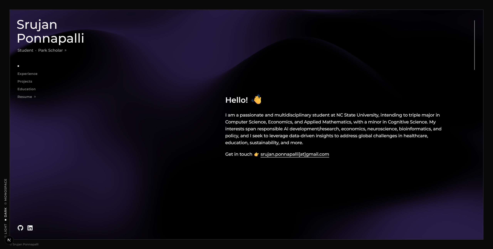

# Srujan Ponnapalli's Personal Portfolio

This is the source code for my personal portfolio website, built with Next.js and TypeScript. It's designed to be a clean, modern, and interactive showcase of my skills, experience, and education.

**Live At:** [srujanponnapalli.vercel.app](https://srujanponnapalli.vercel.app/)

## ✨ Features

- **Responsive Design:** Fully responsive layout that adapts to all screen sizes, from mobile to desktop.
- **Theme Switcher:** Toggle between light and dark modes for a comfortable viewing experience.
- **Interactive UI:** Features smooth animations and hover effects for an engaging user experience, including an expanding underline on links.
- **Dynamic Content Sections:** Includes dedicated, scroll-snapping sections for "About Me," "Experience," "Education," and "Projects."
- **WebGL Animated Gradient:** A performant and visually appealing animated gradient background powered by WebGL.
- **Component-Based Architecture:** Built with reusable React components and styled with CSS Modules for maintainable and scoped styling.

## 🚀 Tech Stack

- **Framework:** Next.js (App Router)
- **Language:** TypeScript
- **Styling:** CSS Modules
- **Icons:** React Icons
- **Linting/Formatting:** ESLint & Prettier (via Next.js defaults)

## 🙏 Acknowledgements

- The WebGL animated gradient background is a modified version of the code from [this gist by @jordienr](https://gist.github.com/jordienr/64bcf75f8b08641f205bd6a1a0d4ce1d).